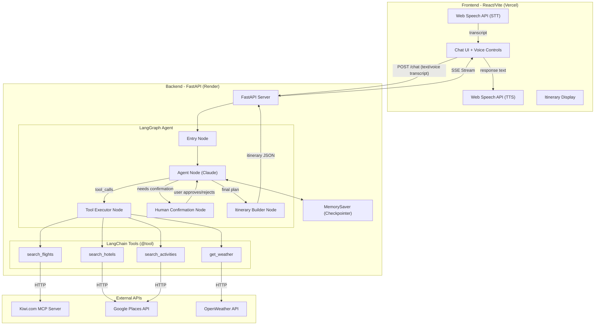
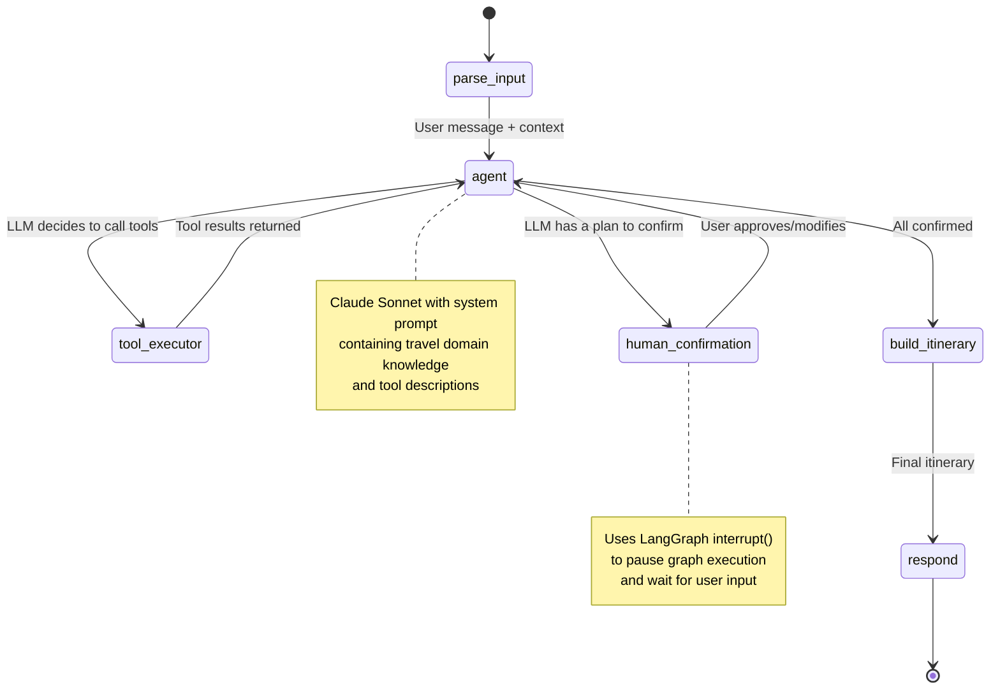

# AI-Powered Personal Travel Assistant — Architecture & Implementation Plan

## Problem Statement

> **"Planning a trip is fragmented, overwhelming, and time-consuming."**
>
> Travelers juggle 5-8 different websites/apps (flights, hotels, activities, weather) to plan a single trip. There's no unified, conversational interface that understands your preferences, budget, and context — and plans everything in one place with real-time data.

**Our Solution:** A conversational AI travel assistant (text + voice) that acts as your personal travel agent — understanding natural language, searching real APIs, and building a complete itinerary (flights → hotels → activities → weather) with human-in-the-loop confirmation at every step.

---

## Tech Stack — One-Line Definitions

| Layer | Tool/Library | Purpose |
|-------|-------------|---------|
| **LLM** | `langchain-anthropic` (Claude Sonnet) | Core reasoning engine — understands user intent, generates travel plans, orchestrates tool calls |
| **Agent Framework** | `langgraph` | Stateful agentic workflow with nodes, edges, human-in-the-loop checkpoints, and tool execution |
| **Checkpointing** | `MemorySaver` (langgraph) | In-memory state persistence for conversation threads — enables pause/resume for human confirmations |
| **Backend** | `FastAPI` + `uvicorn` | Async Python web server exposing REST + SSE streaming endpoints for the React frontend |
| **Frontend** | `React` (Vite) | Modern SPA with chat UI, voice controls, and itinerary display |
| **Voice STT** | Web Speech API (`react-speech-recognition`) | Browser-native speech-to-text — free, no API key needed, works in Chrome/Edge |
| **Voice TTS** | Web Speech API (`window.speechSynthesis`) | Browser-native text-to-speech — reads AI responses aloud |
| **Flight Search** | Kiwi.com MCP Server (`https://mcp.kiwi.com`) | Free flight search via MCP protocol — searches one-way/round-trip flights with real prices |
| **Hotels** | Google Places API (New) | Search for hotels/accommodations at destination with ratings, pricing, photos |
| **Activities** | Google Places API (New) | Search for attractions, restaurants, experiences at destination |
| **Weather** | OpenWeather API (free tier) | Current + forecast weather data for travel dates — 60 calls/min free |
| **HTTP Client** | `httpx` | Async HTTP client for making non-blocking API calls from LangGraph tools |
| **Environment** | `python-dotenv` | Loads API keys from `.env` file securely |
| **CORS** | `fastapi[cors]` | Enables cross-origin requests from React frontend to FastAPI backend |
| **Deployment (FE)** | Vercel | Free hosting for React/Vite static frontend |
| **Deployment (BE)** | Render | Free hosting for FastAPI backend (stateful, supports long-running processes) |

---

## User Review Required

> [!IMPORTANT]
> **Amadeus Self-Service API is SHUT DOWN** — Amadeus decommissioned their entire self-service developer portal on **July 17, 2026**. All API keys are deactivated. We **cannot** use Amadeus for this hackathon.

> [!IMPORTANT]
> **Skyscanner API requires partner approval** — Not available for self-service developers. Same for Kiwi.com's direct REST API (invitation-only since May 2024).

> [!WARNING]
> **Deployment Architecture Change** — Vercel is **stateless/serverless** and cannot maintain LangGraph's in-memory checkpointing state between requests. We need a **persistent backend server**. Recommendation:
> - **Frontend → Vercel** (free, perfect for React/Vite static builds)
> - **Backend → Render** (free tier, supports persistent Python processes, cold starts after 15min idle — acceptable for hackathon demo)

> [!IMPORTANT]
> **Rasa vs Web Speech API** — The hackathon mentions Rasa, but Rasa is a full NLU framework for building chatbot pipelines. Since we're using **LangChain + Claude** as our NLU/reasoning engine, Rasa would be **redundant and over-engineered**. Instead:
> - **STT (Speech-to-Text):** Browser's Web Speech API via `react-speech-recognition` — free, zero-config
> - **TTS (Text-to-Speech):** Browser's `SpeechSynthesis` API — free, built-in
> - **NLU (Intent/Entity):** Claude via LangChain — far more powerful than Rasa's NLU pipeline
>
> This satisfies the "voice + text + NLP" requirement without adding Rasa's complexity.

> [!WARNING]
> **Claude API Key Required** — You'll need an Anthropic API key. The free tier gives limited usage but enough for hackathon demo. Set `ANTHROPIC_API_KEY` in `.env`.

---

## Open Questions

> [!IMPORTANT]
> 1. **Claude API Key** — Do you already have an Anthropic API key, or should we design a fallback to use a free model (e.g., `groq` with Llama)?
> 2. **Google Cloud API Key** — Do you have a Google Cloud project with Places API enabled? If not, we can use **OpenStreetMap/Nominatim** (completely free) as a fallback for hotel/activity search.
> 3. **OpenWeather API Key** — Do you have one, or should I guide you through the free signup?
> 4. **Hackathon Demo Priority** — Should we prioritize a polished UI or more API integrations for the demo?

---

## Architecture Diagram



---

## LangGraph Agent Flow



---

## Proposed Changes — Folder Structure

```
d:\amedues hackthon\
├── backend/                        # Python FastAPI + LangGraph
│   ├── app/
│   │   ├── __init__.py
│   │   ├── main.py                 # FastAPI app, CORS, routes
│   │   ├── config.py               # Settings, env vars
│   │   ├── graph/
│   │   │   ├── __init__.py
│   │   │   ├── state.py            # TypedDict for graph state
│   │   │   ├── nodes.py            # Agent, tool_executor, human_confirm nodes
│   │   │   └── builder.py          # Graph construction + compile
│   │   ├── tools/
│   │   │   ├── __init__.py
│   │   │   ├── flights.py          # search_flights tool (Kiwi MCP)
│   │   │   ├── hotels.py           # search_hotels tool (Google Places)
│   │   │   ├── activities.py       # search_activities tool (Google Places)
│   │   │   └── weather.py          # get_weather tool (OpenWeather)
│   │   └── prompts/
│   │       └── system.py           # System prompt for the travel agent
│   ├── requirements.txt
│   ├── .env.example
│   └── render.yaml                 # Render deployment config
│
├── frontend/                       # React + Vite
│   ├── src/
│   │   ├── App.jsx
│   │   ├── main.jsx
│   │   ├── index.css
│   │   ├── components/
│   │   │   ├── ChatWindow.jsx      # Main chat interface
│   │   │   ├── MessageBubble.jsx   # Individual message display
│   │   │   ├── VoiceButton.jsx     # STT/TTS toggle
│   │   │   ├── ItineraryCard.jsx   # Display confirmed itinerary
│   │   │   ├── FlightCard.jsx      # Flight result display
│   │   │   ├── HotelCard.jsx       # Hotel result display
│   │   │   └── ConfirmationModal.jsx # Human-in-loop approval UI
│   │   ├── hooks/
│   │   │   ├── useChat.js          # Chat state + SSE streaming
│   │   │   └── useVoice.js         # Speech recognition/synthesis
│   │   └── utils/
│   │       └── api.js              # API client (fetch + SSE)
│   ├── package.json
│   ├── vite.config.js
│   ├── index.html
│   └── vercel.json                 # Vercel deployment config
│
├── .gitignore
└── README.md
```

---

## Proposed Changes — Detailed

### Backend — Core Server

#### [NEW] [main.py](file:///d:/amedues%20hackthon/backend/app/main.py)
- FastAPI app with CORS middleware
- `POST /api/chat` — accepts user message + thread_id, invokes LangGraph, streams response via SSE
- `POST /api/chat/confirm` — receives user confirmation (approve/reject) for human-in-the-loop, resumes graph with `Command(resume=...)`
- `GET /api/health` — health check endpoint

#### [NEW] [config.py](file:///d:/amedues%20hackthon/backend/app/config.py)
- Pydantic `Settings` class loading from `.env`
- Keys: `ANTHROPIC_API_KEY`, `GOOGLE_PLACES_API_KEY`, `OPENWEATHER_API_KEY`

---

### Backend — LangGraph Agent

#### [NEW] [state.py](file:///d:/amedues%20hackthon/backend/app/graph/state.py)
- `TravelState(TypedDict)` with fields:
  - `messages: list` — conversation history (HumanMessage, AIMessage)
  - `travel_preferences: dict` — extracted prefs (destination, dates, budget, travelers)
  - `flight_results: list` — search results from Kiwi
  - `hotel_results: list` — search results from Google Places
  - `activity_results: list` — activity suggestions
  - `weather_data: dict` — weather forecast
  - `itinerary: dict` — confirmed final plan
  - `pending_confirmation: dict` — item awaiting user approval

#### [NEW] [nodes.py](file:///d:/amedues%20hackthon/backend/app/graph/nodes.py)
- `agent_node()` — Invokes Claude with tools, processes responses
- `tool_executor_node()` — Executes tool calls from the agent
- `human_confirmation_node()` — Uses `interrupt()` to pause and wait for user approval
- `build_itinerary_node()` — Compiles confirmed flights + hotels + activities into final itinerary

#### [NEW] [builder.py](file:///d:/amedues%20hackthon/backend/app/graph/builder.py)
- Creates `StateGraph(TravelState)`
- Wires nodes: entry → agent → (tools | confirmation) → agent → itinerary
- Compiles with `MemorySaver` checkpointer
- Conditional edges based on agent output (tool_calls vs confirmation vs final)

---

### Backend — LangChain Tools

#### [NEW] [flights.py](file:///d:/amedues%20hackthon/backend/app/tools/flights.py)
- `@tool async search_flights(origin, destination, departure_date, return_date?, adults, cabin_class)`
- Calls Kiwi.com MCP server at `https://mcp.kiwi.com` via HTTP
- Returns structured flight options (price, airline, duration, booking_link)

#### [NEW] [hotels.py](file:///d:/amedues%20hackthon/backend/app/tools/hotels.py)
- `@tool async search_hotels(destination, check_in, check_out, budget_level)`
- Calls Google Places API (New) Text Search for hotels
- Returns hotels with name, rating, price_level, address, photos

#### [NEW] [activities.py](file:///d:/amedues%20hackthon/backend/app/tools/activities.py)
- `@tool async search_activities(destination, interests)`
- Calls Google Places API for attractions, restaurants, experiences
- Returns activities with name, rating, type, description

#### [NEW] [weather.py](file:///d:/amedues%20hackthon/backend/app/tools/weather.py)
- `@tool async get_weather(city, date)`
- Calls OpenWeather API free tier
- Returns temperature, conditions, rain probability

---

### Frontend — React (Vite)

#### [NEW] [App.jsx](file:///d:/amedues%20hackthon/frontend/src/App.jsx)
- Main app layout: sidebar (itinerary) + chat window + voice controls
- Theme: dark mode, glassmorphism, premium travel aesthetic

#### [NEW] [ChatWindow.jsx](file:///d:/amedues%20hackthon/frontend/src/components/ChatWindow.jsx)
- Real-time chat with SSE streaming (typing effect)
- Renders `MessageBubble`, `FlightCard`, `HotelCard`, `ConfirmationModal`
- Auto-scroll, loading states

#### [NEW] [VoiceButton.jsx](file:///d:/amedues%20hackthon/frontend/src/components/VoiceButton.jsx)
- Mic toggle using `react-speech-recognition`
- Visual waveform animation when listening
- Auto-sends transcript when speech ends

#### [NEW] [ConfirmationModal.jsx](file:///d:/amedues%20hackthon/frontend/src/components/ConfirmationModal.jsx)
- Appears when agent sends a `pending_confirmation` event
- Shows flight/hotel details with Approve / Modify / Reject buttons
- Sends confirmation back via `POST /api/chat/confirm`

#### [NEW] [useChat.js](file:///d:/amedues%20hackthon/frontend/src/hooks/useChat.js)
- Custom hook managing: messages state, thread_id, SSE connection
- `sendMessage(text)` — POST to backend, opens SSE stream
- `confirmAction(action, data)` — POST confirmation to resume graph

#### [NEW] [useVoice.js](file:///d:/amedues%20hackthon/frontend/src/hooks/useVoice.js)
- Wraps `react-speech-recognition` + `SpeechSynthesis`
- `startListening()`, `stopListening()`, `speak(text)`

---

### Configuration & Deployment

#### [NEW] [.env.example](file:///d:/amedues%20hackthon/backend/.env.example)
```
ANTHROPIC_API_KEY=your_key_here
GOOGLE_PLACES_API_KEY=your_key_here
OPENWEATHER_API_KEY=your_key_here
```

#### [NEW] [render.yaml](file:///d:/amedues%20hackthon/backend/render.yaml)
- Web service: Python, `pip install -r requirements.txt`, `uvicorn app.main:app`

#### [NEW] [vercel.json](file:///d:/amedues%20hackthon/frontend/vercel.json)
- Rewrites to proxy `/api/*` to Render backend URL

#### [NEW] [README.md](file:///d:/amedues%20hackthon/README.md)
- Project overview, architecture diagram, setup instructions, API key setup, deployment guide

---

## MVP Workflow — What the Demo Does

```
User: "Plan a 5-day trip to Goa from Delhi for 2 people, budget ₹50,000"
                    ↓
   [Agent extracts: origin=DEL, dest=GOA, dates, budget, pax=2]
                    ↓
   [Tool: search_flights(DEL → GOA)] → Shows 3 flight options
                    ↓
   [Human-in-loop: "I found these flights. Which one?"]
   User: "Option 2 looks good" ✅
                    ↓
   [Tool: search_hotels(GOA, budget)] → Shows 3 hotel options
                    ↓
   [Human-in-loop: "Here are hotels. Confirm?"]
   User: "Yes, the beach resort" ✅
                    ↓
   [Tool: search_activities(GOA)] → Suggests beaches, temples, water sports
   [Tool: get_weather(GOA, dates)] → "Sunny, 32°C, low rain"
                    ↓
   [Build Itinerary] → Complete day-by-day plan
                    ↓
   📋 Final itinerary displayed in sidebar with all details
```

---

## Verification Plan

### Automated Tests
```bash
# Backend
cd backend
python -m pytest tests/ -v

# Frontend  
cd frontend
npm run build  # Verify production build succeeds
```

### Manual Verification
1. Start backend: `uvicorn app.main:app --reload --port 8000`
2. Start frontend: `npm run dev` (port 5173)
3. Test complete flow: Text message → Flight search → Confirmation → Hotel → Activities → Itinerary
4. Test voice: Click mic → Speak → Verify transcript sent → Verify TTS reads response
5. Test SSE streaming: Verify typing effect in chat
6. Test error handling: Invalid city, no results, API timeout

---

## Execution Order

1. **Backend Setup** — Virtual env, dependencies, `.env`
2. **LangGraph Agent** — State, nodes, graph builder (core logic)
3. **Tools** — Flight, hotel, activity, weather tool implementations
4. **FastAPI Routes** — Chat endpoint with SSE streaming
5. **Frontend Setup** — Vite React scaffolding
6. **Chat UI** — ChatWindow, MessageBubble, streaming
7. **Voice** — STT/TTS integration
8. **Confirmation UI** — Human-in-loop modal
9. **Itinerary Display** — Final plan card
10. **Polish** — Styling, animations, README
11. **Deploy** — Render (BE) + Vercel (FE)
